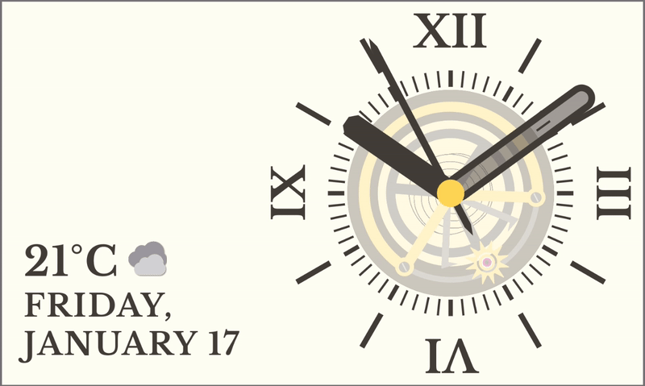
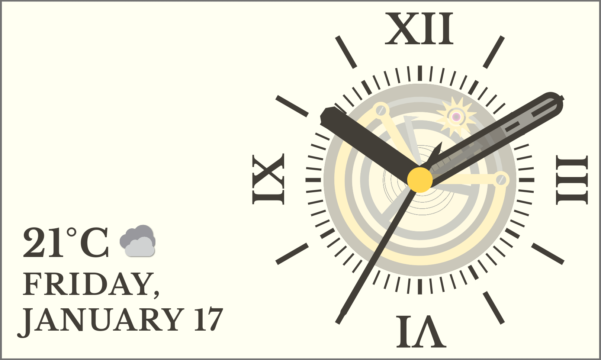
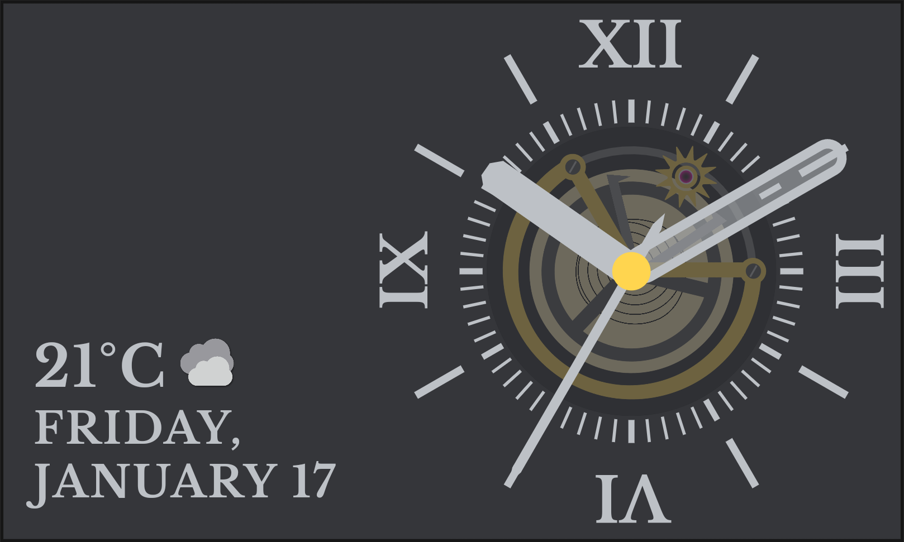

# Tourbillon Clock

> Tourbillon Clock is built on Flutter. This is my project for the [Flutter Clock challenge](https://flutter.dev/clock). 

Tourbillon clock is bold classic analog clock with [tourbillon mechanism](https://en.wikipedia.org/wiki/Tourbillon), it also provide other information such as day, date and weather(with condition icon) at the glance.

# Screenshots

Light

Dark

Tourbillon mechanism animation is covered with Tinted Glass(Widget) to make clock easy on eye. Tourbillon widget is built with 2 animations. First is the RotationTransition animation which completes in a minute, And second is Flare Animation with duration of a second.
[TicklessHand](tourbillon_clock/lib/src/widgets/tickless_hand.dart) is a AnimatedWidget to indicate second with a tickless animation.
Weather icon indicates the weather condition.

# LICENSES

Source code is licensed under [BSD 3-Clause](tourbillon_clock/LICENSE).
Tourbillon flare animation available on [Rive.app](https://rive.app/a/Shakir/files/flare/tourbillon/preview) is licensed under [CC BY](https://creativecommons.org/licenses/by/4.0/).
Weather Icons assets licensed under [Apache 2.0](tourbillon_clock/assets/LICENSE).

LibreBaskerville font [Open Font License](tourbillon_clock/third_party/LibreBaskerville-OFL.txt).
PlayfairDisplay font [Open Font License](tourbillon_clock/third_party/PlayfairDisplay-OFL.txt).